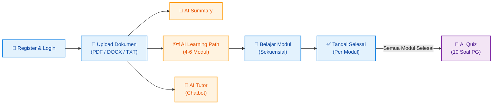
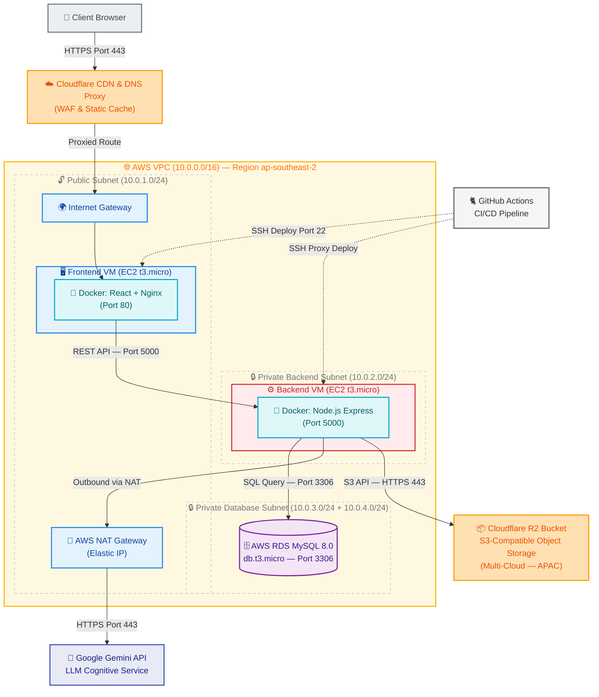
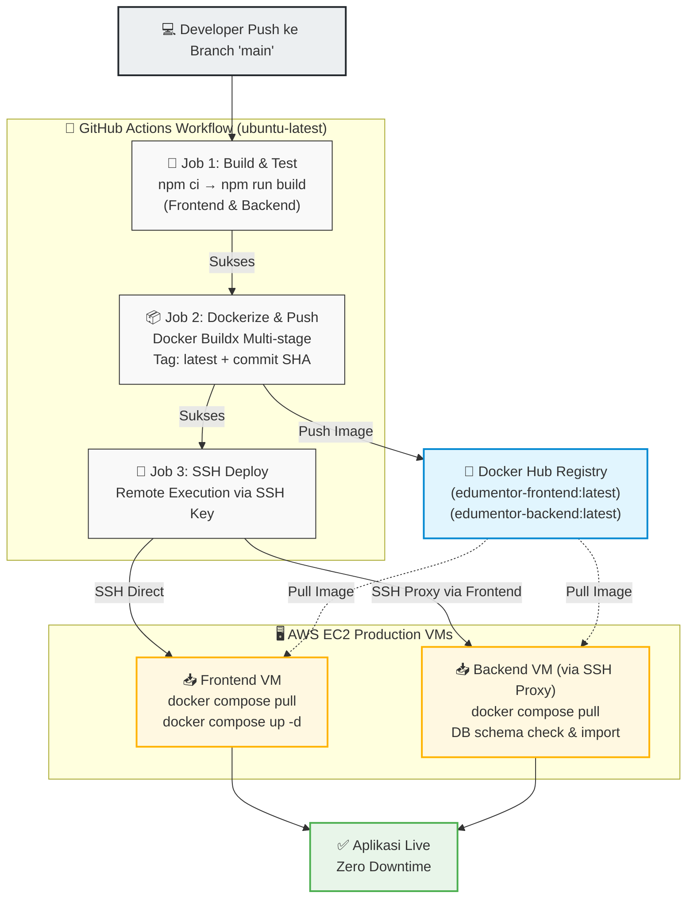

# LAPORAN EVALUASI AKHIR SEMESTER (EAS) CLOUD COMPUTING
## EDUMENTOR AI: SISTEM PEMBELAJARAN ADAPTIF BERBASIS AI DENGAN ARSITEKTUR CLOUD NATIVE DAN MULTI-CLOUD STORAGE
**Mendukung Sustainable Development Goals (SDGs) No. 4: Pendidikan Berkualitas**

---

## DAFTAR ISI

1. Latar Belakang Masalah
2. Analisis Sistem
3. Arsitektur Cloud
4. Integrasi AI
5. CI/CD
6. Tutorial Deployment
7. Monitoring Sistem
8. Kesimpulan

---

## 1. Latar Belakang Masalah

Di era digitalisasi saat ini, kebutuhan akan efisiensi pembelajaran menjadi sangat krusial, terutama bagi pelajar dan mahasiswa di tingkat pendidikan tinggi. Volume materi akademis yang sangat besar, baik dalam bentuk dokumen PDF buku referensi, slide presentasi (PPT), maupun dokumen teks (.docx), seringkali membuat mahasiswa mengalami *cognitive overload* atau kewalahan dalam memilah informasi penting. Fenomena ini bukan sekadar masalah teknis, melainkan masalah struktural yang mempengaruhi kualitas pemahaman konseptual mahasiswa terhadap materi perkuliahan yang kompleks.

Pembelajaran konvensional sering kali tidak mampu memfasilitasi kebutuhan individu secara unik. Setiap mahasiswa memiliki kecepatan belajar (*learning pace*) dan metode pemahaman konsep yang berbeda. Beberapa mahasiswa lebih menyukai ringkasan poin penting (*summarization*), sementara yang lain membutuhkan peta konsep yang terstruktur secara kronologis (*learning path*) untuk memahami suatu topik dari tingkat dasar hingga mahir. Model kelas tatap muka konvensional tidak dirancang untuk mengakomodasi variasi gaya belajar ini secara simultan dan real-time.

Untuk menjembatani kesenjangan ini, diperlukan sebuah platform pembelajaran digital cerdas (*Learning Management System* / LMS berbasis AI) yang mampu memproses dokumen akademis secara otomatis, menyusun kurikulum adaptif sesuai isi dokumen tersebut, menyediakan evaluasi kognitif interaktif secara real-time, serta menyediakan layanan asisten akademik virtual yang selalu siap menjawab pertanyaan terkait isi modul belajar tersebut. Platform ini perlu dibangun di atas fondasi infrastruktur cloud yang andal, aman, dan mudah dikelola.

Proyek **EduMentor AI** hadir sebagai jawaban atas kebutuhan tersebut. EduMentor AI merupakan platform LMS adaptif yang memanfaatkan kecerdasan buatan (*Artificial Intelligence*) dari Google Gemini API untuk memproses dan menyusun konten edukasi secara otomatis dari dokumen akademis. Dari sisi infrastruktur, EduMentor AI dirancang menggunakan arsitektur *Cloud Native* di Amazon Web Services (AWS) dengan segmentasi VPC, NAT Gateway untuk keamanan outbound, dan pendekatan *Multi-Cloud* yang memanfaatkan Cloudflare R2 sebagai *Object Storage* independen.

Proyek ini juga secara langsung mendukung agenda global Perserikatan Bangsa-Bangsa (PBB) yaitu **Sustainable Development Goals (SDGs) Goal 4: Quality Education (Pendidikan Berkualitas)**. Relevansi antara fitur utama EduMentor AI dengan indikator pencapaian SDGs No. 4 dipetakan pada Tabel 1.

##### Tabel 1: Relevansi Fitur EduMentor AI dengan Indikator SDGs No. 4

| Indikator SDGs No. 4 | Masalah Konvensional | Solusi / Fitur EduMentor AI | Teknologi Pendukung |
| :--- | :--- | :--- | :--- |
| **4.3 Akses Setara & Terjangkau** | Akses ke ringkasan & bimbingan belajar berkualitas berbiaya mahal | **AI Summary & AI Tutor** mandiri tanpa biaya tambahan | Google Gemini API, Node.js Express |
| **4.4 Peningkatan Keterampilan** | Literasi digital dan analisis materi yang lambat | **AI Learning Path** membagi materi menjadi modul berurutan | React Frontend, Adaptive Progress |
| **4.5 Kesetaraan Gender & Inklusi** | Pembatasan geografis dan keterbatasan waktu belajar mandiri | Platform web responsif yang dapat diakses di mana saja | TailwindCSS v4, Nginx Container |
| **4.a Fasilitas Pendidikan Aman** | Data dokumen akademis rentan bocor jika disimpan lokal | Infrastruktur **Cloud-Native terisolasi** dan multi-cloud storage | AWS VPC, Cloudflare R2, Security Groups |

Sebagaimana ditunjukkan pada Tabel 1, masing-masing fitur EduMentor AI dirancang untuk merespons indikator SDGs secara spesifik. Fitur AI Summary dan AI Tutor menjawab indikator 4.3 tentang akses setara terhadap pendidikan berkualitas, sementara arsitektur cloud-native dengan segmentasi VPC menjawab indikator 4.a tentang penyediaan fasilitas pendidikan yang aman dan terlindungi.

---

## 2. Analisis Sistem

### 2.1 Deskripsi Fungsional Sistem

EduMentor AI dirancang sebagai platform pembelajaran adaptif mandiri yang memungkinkan pengguna mengunggah dokumen materi kuliah, lalu sistem secara otomatis mengolahnya menjadi konten edukasi yang terstruktur. Proses ini melibatkan beberapa tahapan fungsional yang saling terintegrasi melalui arsitektur RESTful API. Pengguna pertama-tama melakukan registrasi dan login menggunakan JSON Web Token (JWT), lalu mengunggah file berupa PDF, Word (.docx), atau teks biasa (.txt) melalui antarmuka unggah dokumen.

Backend Express secara otomatis melakukan ekstraksi teks dari dokumen yang diunggah menggunakan parser khusus. File PDF diproses menggunakan library `pdf-parse`, file Word (.docx) menggunakan `mammoth`, dan file teks biasa dibaca langsung dari *filesystem*. Logika ekstraksi teks ini diimplementasikan pada fungsi `extractText()` yang ditunjukkan pada Kode Program 1.

##### Kode Program 1: Fungsi Ekstraksi Teks Multi-Format (materialController.js)
```javascript
const extractText = async (filePath, mimeType) => {
  if (mimeType === "application/pdf") {
    const buffer = fs.readFileSync(filePath);
    const parser = new PDFParse({ data: buffer });
    await parser.load();
    const result = await parser.getText();
    await parser.destroy();
    return result.text;
  }

  if (mimeType === "application/vnd.openxmlformats-officedocument" +
      ".wordprocessingml.document") {
    const result = await mammoth.extractRawText({ path: filePath });
    return result.value;
  }

  if (mimeType === "text/plain") {
    return fs.readFileSync(filePath, "utf8");
  }

  throw new Error("Unsupported file type");
};
```

Kode Program 1 menunjukkan bagaimana sistem menentukan metode parsing berdasarkan tipe MIME file yang diunggah. Fungsi ini dipanggil di dalam controller `uploadMaterial` sebelum teks hasil ekstraksi disimpan ke kolom `content` pada tabel `materials` di database MySQL. Pendekatan ini memungkinkan satu endpoint API menangani tiga format dokumen berbeda secara transparan tanpa memerlukan konfigurasi tambahan dari sisi pengguna.

Setelah teks berhasil diekstrak, pengguna dapat memicu empat fitur AI utama. Pertama, fitur **AI Summary** menghasilkan ringkasan padat konsep inti dalam format Markdown. Kedua, fitur **AI Learning Path** memecah dokumen menjadi 4-6 modul pembelajaran berurutan. Ketiga, fitur **AI Quiz** membuat 10 pertanyaan pilihan ganda interaktif setelah seluruh modul diselesaikan. Keempat, fitur **AI Tutor** menyediakan chatbot konsultasi interaktif yang konteksnya dibatasi hanya pada isi dokumen yang relevan.

### 2.2 Arsitektur Modul Pembelajaran Adaptif

Sistem pembelajaran adaptif di EduMentor AI beroperasi menggunakan model *linear progression validation*. Saat file materi diunggah, data masuk ke tabel `materials`. Setelah pengguna memicu pembuatan learning path, AI menghasilkan 4-6 record di tabel `learning_modules`. Di antarmuka frontend, modul-modul ini ditampilkan dalam struktur alur belajar step-by-step, di mana modul ke-*n* hanya dapat dibuka jika terdapat record penyelesaian di tabel `user_progress` untuk modul ke-*n-1*. Kuis akhir hanya dapat diakses setelah seluruh modul dalam satu materi berstatus selesai (`is_completed = TRUE`).

Alur kerja keseluruhan sistem dari perspektif pengguna digambarkan secara visual pada Gambar 1.


##### Gambar 1: Alur Kerja Pengguna pada Sistem EduMentor AI

Gambar 1 memperlihatkan bahwa alur belajar bersifat sekuensial dan terkunci. Pengguna wajib menyelesaikan setiap modul secara berurutan sebelum dapat mengakses kuis akhir. Fitur AI Tutor dapat diakses kapan saja tanpa terikat urutan modul karena fungsinya sebagai konsultan akademik mandiri.

### 2.3 Perancangan Basis Data

Basis data yang digunakan adalah MySQL 8.0 relasional dengan rancangan schema ternormalisasi yang menjamin integritas data melalui foreign key constraints dan cascading delete. Skema lengkap basis data yang diimplementasikan ditunjukkan pada Kode Program 2.

##### Kode Program 2: Skema Basis Data Relasional MySQL (database/schema.sql)
```sql
CREATE TABLE users (
  id INT AUTO_INCREMENT PRIMARY KEY,
  name VARCHAR(100),
  email VARCHAR(100) UNIQUE,
  password VARCHAR(255),
  created_at TIMESTAMP DEFAULT CURRENT_TIMESTAMP
);

CREATE TABLE materials (
  id INT AUTO_INCREMENT PRIMARY KEY,
  user_id INT NOT NULL,
  title VARCHAR(255),
  file_url TEXT,
  content LONGTEXT,
  summary LONGTEXT,
  summary_generated BOOLEAN DEFAULT FALSE,
  learning_path_generated BOOLEAN DEFAULT FALSE,
  created_at TIMESTAMP DEFAULT CURRENT_TIMESTAMP,
  FOREIGN KEY (user_id) REFERENCES users(id) ON DELETE CASCADE
);

CREATE TABLE learning_modules (
  id INT AUTO_INCREMENT PRIMARY KEY,
  material_id INT NOT NULL,
  title VARCHAR(255),
  content LONGTEXT,
  estimated_minutes INT DEFAULT 10,
  order_number INT,
  FOREIGN KEY (material_id) REFERENCES materials(id) ON DELETE CASCADE
);

CREATE TABLE user_progress (
  id INT AUTO_INCREMENT PRIMARY KEY,
  user_id INT NOT NULL,
  module_id INT NOT NULL,
  is_completed BOOLEAN DEFAULT FALSE,
  progress_percentage INT DEFAULT 0,
  completed_at TIMESTAMP NULL,
  UNIQUE(user_id, module_id),
  FOREIGN KEY(user_id) REFERENCES users(id) ON DELETE CASCADE,
  FOREIGN KEY(module_id) REFERENCES learning_modules(id) ON DELETE CASCADE
);

CREATE TABLE quizzes (
  id INT AUTO_INCREMENT PRIMARY KEY,
  material_id INT NOT NULL,
  title VARCHAR(255),
  created_at TIMESTAMP DEFAULT CURRENT_TIMESTAMP,
  FOREIGN KEY(material_id) REFERENCES materials(id) ON DELETE CASCADE
);

CREATE TABLE quiz_questions (
  id INT AUTO_INCREMENT PRIMARY KEY,
  quiz_id INT NOT NULL,
  question TEXT, option_a TEXT, option_b TEXT,
  option_c TEXT, option_d TEXT,
  correct_answer CHAR(1),
  explanation TEXT,
  FOREIGN KEY(quiz_id) REFERENCES quizzes(id) ON DELETE CASCADE
);

CREATE TABLE quiz_attempts (
  id INT AUTO_INCREMENT PRIMARY KEY,
  user_id INT NOT NULL,
  quiz_id INT NOT NULL,
  score INT, total_questions INT,
  answers TEXT NULL,
  created_at TIMESTAMP DEFAULT CURRENT_TIMESTAMP,
  FOREIGN KEY(user_id) REFERENCES users(id) ON DELETE CASCADE,
  FOREIGN KEY(quiz_id) REFERENCES quizzes(id) ON DELETE CASCADE
);
```

Kode Program 2 memperlihatkan enam tabel utama yang saling berelasi. Tabel `users` menyimpan data autentikasi. Tabel `materials` menampung metadata dan konten hasil ekstraksi dokumen. Tabel `learning_modules` menyimpan modul-modul belajar hasil generate AI. Tabel `user_progress` mencatat kemajuan penyelesaian modul per pengguna dengan constraint `UNIQUE(user_id, module_id)` untuk mencegah duplikasi data progress. Tabel `quizzes` dan `quiz_questions` menyimpan soal hasil generate AI, sementara `quiz_attempts` merekam skor pengerjaan kuis. Relasi antar tabel diterapkan menggunakan `ON DELETE CASCADE` sehingga penghapusan satu materi akan secara otomatis menghapus seluruh data turunannya (modul, progress, kuis, dan skor).

### 2.4 Dokumentasi API

Seluruh komunikasi data antara Frontend React dan Backend Node.js dilayani melalui arsitektur RESTful API. Setiap endpoint dikategorikan ke dalam modul fungsional dan dilindungi oleh middleware autentikasi JWT kecuali endpoint registrasi dan login. Dokumentasi lengkap endpoint API ditampilkan pada Tabel 2.

##### Tabel 2: Dokumentasi Endpoint RESTful API Backend

| Modul | Method | Endpoint | Fungsi Layanan | Auth |
| :--- | :--- | :--- | :--- | :--- |
| **Auth** | POST | `/api/auth/register` | Registrasi akun pengguna baru (bcrypt hash) | Publik |
| **Auth** | POST | `/api/auth/login` | Login dan mengembalikan JWT token (masa berlaku 7 hari) | Publik |
| **Material** | GET | `/api/materials` | Mengambil daftar semua materi milik pengguna | JWT |
| **Material** | POST | `/api/materials/upload` | Mengunggah dokumen materi (PDF/Word/TXT, maks 25MB) | JWT |
| **Material** | PUT | `/api/materials/:id` | Memperbarui judul materi | JWT |
| **Material** | DELETE | `/api/materials/:id` | Menghapus materi beserta file R2, modul, kuis, dan progress | JWT |
| **Material** | GET | `/api/materials/:id/modules` | Mengambil modul learning path beserta status completion | JWT |
| **Material** | POST | `/api/materials/modules/:moduleId/complete` | Menandai modul sebagai selesai (insert user_progress) | JWT |
| **AI Engine** | POST | `/api/ai/summary/:id` | Generate ringkasan materi dengan Gemini API | JWT |
| **AI Engine** | POST | `/api/ai/learning-path/:id` | Generate 4-6 modul belajar berurutan (output JSON) | JWT |
| **AI Engine** | POST | `/api/ai/quiz/:id` | Generate 10 kuis kognitif PG (setelah semua modul selesai) | JWT |
| **AI Engine** | POST | `/api/ai/tutor/:id` | Konsultasi interaktif context-aware dengan AI tutor | JWT |
| **Quiz** | GET | `/api/quizzes/material/:materialId` | Mengambil daftar kuis berdasarkan materi | JWT |
| **Quiz** | GET | `/api/quizzes/:id` | Mengambil detail pertanyaan kuis | JWT |
| **Quiz** | POST | `/api/quizzes/:id/submit` | Mengirim jawaban, mengoreksi, dan menyimpan skor | JWT |

Tabel 2 menunjukkan bahwa terdapat 15 endpoint utama yang terbagi dalam empat modul. Seluruh endpoint kecuali modul Auth dilindungi oleh JSON Web Token yang disertakan pada header `Authorization` setiap request. Token ini berlaku selama 7 hari sejak proses login berhasil dilakukan.

---

## 3. Arsitektur Cloud

### 3.1 Konsep Cloud Native dan Segmentasi VPC

Aplikasi EduMentor AI diimplementasikan menggunakan pendekatan arsitektur *Cloud Native* yang menekankan pada penggunaan container (Docker), otomatisasi infrastruktur (Terraform), pembagian service terpisah, dan isolasi jaringan tingkat tinggi untuk keamanan data. Seluruh infrastruktur cloud di-provisioning secara otomatis menggunakan Terraform (Infrastructure as Code) yang mendeskripsikan setiap resource AWS dan Cloudflare dalam file konfigurasi deklaratif.

Untuk meminimalisir risiko kebocoran data dan membatasi *blast radius* serangan siber, sistem jaringan AWS VPC dibagi menjadi beberapa sub-jaringan terisolasi (segmentasi VPC/Subnets). Spesifikasi lengkap infrastruktur yang dibuat oleh Terraform dicantumkan pada Tabel 3.

##### Tabel 3: Spesifikasi Infrastruktur Terraform AWS & Cloudflare

| Komponen Infrastruktur | Spesifikasi Teknis | Akses Jaringan |
| :--- | :--- | :--- |
| **AWS VPC** | CIDR `10.0.0.0/16`, DNS Hostnames Enabled | Jaringan induk terisolasi |
| **Frontend Subnet** | CIDR `10.0.1.0/24`, Public, AZ `ap-southeast-2a` | Internet Gateway (port 80/8080/22) |
| **Backend Subnet** | CIDR `10.0.2.0/24`, Private, AZ `ap-southeast-2a` | Hanya dari Frontend SG (port 5000) |
| **DB Subnet A** | CIDR `10.0.3.0/24`, Private, AZ `ap-southeast-2a` | Hanya dari Backend SG (port 3306) |
| **DB Subnet B** | CIDR `10.0.4.0/24`, Private, AZ `ap-southeast-2b` | Multi-AZ RDS Subnet Group |
| **Frontend EC2** | `t3.micro`, Ubuntu 22.04 LTS, Docker pre-installed | Public IP, SSH Key Pair |
| **Backend EC2** | `t3.micro`, Ubuntu 22.04 LTS, Docker pre-installed | Private IP only, NAT Gateway outbound |
| **AWS NAT Gateway** | Elastic IP di Public Subnet | Outbound internet untuk Backend VM |
| **AWS RDS MySQL** | MySQL 8.0, `db.t3.micro`, 20GB Storage | Private, no public IP |
| **Cloudflare R2** | Bucket `edumentor-materials-bucket`, Region APAC | S3-Compatible API (HTTPS 443) |
| **Cloudflare CDN** | DNS Proxy aktif (`proxied = true`) | Global Edge Locations |

Tabel 3 merangkum seluruh komponen infrastruktur yang dikelola oleh Terraform. Setiap komponen ditempatkan pada subnet yang sesuai dengan tingkat keamanannya, dari subnet publik untuk Frontend VM hingga subnet paling terisolasi untuk database RDS MySQL.

Topologi jaringan yang memetakan hubungan antar komponen infrastruktur ini divisualisasikan secara menyeluruh pada Gambar 2.


##### Gambar 2: Diagram Arsitektur Cloud-Native & Multi-Cloud EduMentor AI

Gambar 2 menunjukkan bahwa traffic pengguna dari browser melewati Cloudflare CDN terlebih dahulu sebelum diteruskan ke Internet Gateway AWS dan masuk ke Frontend VM di Public Subnet. Frontend VM berkomunikasi dengan Backend VM di Private Subnet melalui internal routing port 5000. Backend VM yang membutuhkan akses internet keluar (untuk memanggil Google Gemini API) merutekan koneksinya melalui NAT Gateway yang ditempatkan di Public Subnet. Database RDS MySQL hanya dapat diakses dari Backend VM melalui port 3306. Penyimpanan file dokumen dilakukan secara multi-cloud ke Cloudflare R2 yang terpisah sepenuhnya dari infrastruktur AWS.

### 3.2 Aturan Keamanan Jaringan (Security Groups)

Keamanan lalu lintas data antar subnet diatur secara ketat melalui AWS Security Groups yang berfungsi sebagai *stateful firewall* di level instance. Setiap Security Group mengizinkan hanya trafik minimum yang diperlukan (*principle of least privilege*). Konfigurasi aturan keamanan yang diterapkan dijabarkan pada Tabel 4.

##### Tabel 4: Konfigurasi Aturan Security Groups (Firewall)

| Security Group | Arah | Protokol/Port | Sumber/Tujuan | Deskripsi |
| :--- | :--- | :--- | :--- | :--- |
| **frontend-sg** | Ingress | TCP 80 | `0.0.0.0/0` | HTTP Web Access publik |
| **frontend-sg** | Ingress | TCP 8080 | `0.0.0.0/0` | Vite Dev Access publik |
| **frontend-sg** | Ingress | TCP 22 | `0.0.0.0/0` | SSH Admin Access |
| **frontend-sg** | Egress | All Traffic | `0.0.0.0/0` | Koneksi keluar penuh |
| **backend-sg** | Ingress | TCP 5000 | `frontend-sg` ID | API hanya dari Frontend VM |
| **backend-sg** | Ingress | TCP 22 | `0.0.0.0/0` | SSH Admin Access |
| **backend-sg** | Egress | All Traffic | `0.0.0.0/0` | Via NAT Gateway ke internet |
| **database-sg** | Ingress | TCP 3306 | `backend-sg` ID | MySQL hanya dari Backend VM |
| **database-sg** | Egress | All Traffic | `0.0.0.0/0` | Koneksi keluar (update, dsb.) |

Tabel 4 memperlihatkan bahwa setiap tier memiliki aturan keamanan bertingkat. Backend Security Group hanya menerima trafik TCP port 5000 dari instance yang memiliki Security Group ID `frontend-sg`, bukan dari CIDR block tertentu. Pendekatan berbasis Security Group ID ini lebih aman daripada berbasis IP karena tetap valid meskipun IP instance berubah setelah restart.

### 3.3 Multi-Cloud dengan Cloudflare R2

Ketentuan wajib pada arsitektur infrastruktur proyek ini adalah penerapan **Multi-Cloud** untuk menghindari *vendor lock-in* dan meningkatkan *disaster recovery*. Layanan komputasi utama (EC2 dan RDS) dihosting di AWS, sementara penyimpanan dokumen akademis menggunakan Cloudflare R2 Storage yang sepenuhnya terpisah.

Cloudflare R2 menggunakan API yang kompatibel dengan standar AWS S3. Backend Node.js berkomunikasi dengan R2 Bucket menggunakan SDK `@aws-sdk/client-s3` dengan endpoint kustom Cloudflare. Implementasi lengkap layanan penyimpanan multi-cloud ini ditunjukkan pada Kode Program 3.

##### Kode Program 3: Implementasi Cloudflare R2 Storage Service (storageService.js)
```javascript
const { S3Client, PutObjectCommand, DeleteObjectCommand } = require("@aws-sdk/client-s3");
const path = require("path");
const fs = require("fs");

let s3Client = null;
const bucketName = process.env.R2_BUCKET_NAME;

// Inisialisasi Cloudflare R2 client menggunakan S3-compatible API
if (process.env.R2_ACCOUNT_ID && process.env.R2_ACCESS_KEY_ID &&
    process.env.R2_SECRET_ACCESS_KEY && bucketName) {
  s3Client = new S3Client({
    region: "auto",
    endpoint: `https://${process.env.R2_ACCOUNT_ID}.r2.cloudflarestorage.com`,
    credentials: {
      accessKeyId: process.env.R2_ACCESS_KEY_ID,
      secretAccessKey: process.env.R2_SECRET_ACCESS_KEY,
    },
  });
  console.log("Cloudflare R2 Storage client initialized successfully.");
} else {
  console.log("R2 credentials not found. Falling back to local storage.");
}

const uploadFile = async (file) => {
  // Jika R2 dikonfigurasi, upload ke bucket cloud
  if (s3Client && bucketName) {
    const destination = `materials/${Date.now()}_${path.basename(file.originalname)}`;
    const fileStream = fs.createReadStream(file.path);

    await s3Client.send(new PutObjectCommand({
      Bucket: bucketName,
      Key: destination,
      Body: fileStream,
      ContentType: file.mimetype,
    }));

    // Hapus file temporari lokal setelah berhasil upload ke R2
    fs.unlink(file.path, (err) => {
      if (err) console.error("Error removing local temp file:", err.message);
    });

    const r2PublicUrl = process.env.R2_PUBLIC_URL || "https://pub-dummy.r2.dev";
    return `${r2PublicUrl.replace(/\/$/, "")}/${destination}`;
  }

  // Fallback: kembalikan path lokal jika R2 tidak dikonfigurasi
  return file.path.replace(/\\/g, "/");
};
```

Kode Program 3 memperlihatkan mekanisme *dual-mode storage* yang dirancang pada EduMentor AI. Jika kredensial Cloudflare R2 tersedia di environment variables, sistem akan menginisialisasi S3Client dengan endpoint kustom `r2.cloudflarestorage.com` dan mengunggah file ke bucket cloud. Jika kredensial tidak tersedia, sistem secara otomatis melakukan fallback ke penyimpanan lokal di direktori `uploads/` sehingga aplikasi tetap dapat berjalan secara normal di lingkungan development.

### 3.4 Provisioning Infrastruktur dengan Terraform

Seluruh infrastruktur cloud yang dijelaskan di atas didefinisikan secara deklaratif menggunakan Terraform (IaC). Terraform membaca konfigurasi provider AWS dan Cloudflare, lalu secara otomatis membuat VPC, Subnets, Internet Gateway, NAT Gateway, Route Tables, Security Groups, EC2 Instances, RDS MySQL, dan R2 Bucket dalam satu perintah `terraform apply`.

Potongan konfigurasi Terraform yang mendefinisikan VPC utama, subnet frontend (public), dan NAT Gateway ditunjukkan pada Kode Program 4.

##### Kode Program 4: Konfigurasi VPC, Public Subnet, dan NAT Gateway (terraform/main.tf)
```hcl
# Main VPC
resource "aws_vpc" "main_vpc" {
  cidr_block           = var.vpc_cidr
  enable_dns_hostnames = true
  enable_dns_support   = true

  tags = { Name = "edumentor-vpc" }
}

# Internet Gateway (akses publik ke Frontend Subnet)
resource "aws_internet_gateway" "igw" {
  vpc_id = aws_vpc.main_vpc.id
  tags   = { Name = "edumentor-igw" }
}

# Frontend Subnet (Public)
resource "aws_subnet" "frontend_subnet" {
  vpc_id                  = aws_vpc.main_vpc.id
  cidr_block              = var.frontend_subnet_cidr
  availability_zone       = "${var.aws_region}a"
  map_public_ip_on_launch = true

  tags = { Name = "frontend-subnet" }
}

# Elastic IP untuk NAT Gateway
resource "aws_eip" "nat_eip" {
  domain = "vpc"
  tags   = { Name = "edumentor-nat-eip" }
}

# NAT Gateway (di Public Subnet, untuk outbound Backend)
resource "aws_nat_gateway" "nat_gw" {
  allocation_id = aws_eip.nat_eip.id
  subnet_id     = aws_subnet.frontend_subnet.id

  tags       = { Name = "edumentor-nat-gw" }
  depends_on = [aws_internet_gateway.igw]
}
```

Kode Program 4 memperlihatkan bagaimana Terraform mendefinisikan VPC dengan CIDR `10.0.0.0/16`, Internet Gateway untuk akses publik, Frontend Subnet dengan `map_public_ip_on_launch = true` agar setiap instance yang diluncurkan di subnet ini otomatis mendapat IP publik, serta NAT Gateway yang ditempatkan di Public Subnet dengan Elastic IP untuk menyediakan akses internet keluar bagi Backend VM di Private Subnet.

Hasil eksekusi `terraform apply` yang berhasil membuat seluruh resource infrastruktur ditunjukkan pada Gambar 3.

`[Screenshot: Hasil terraform apply — menampilkan daftar resource yang berhasil dibuat]`

##### Gambar 3: Hasil Eksekusi Terraform Apply (Provisioning Infrastruktur AWS & Cloudflare)

Gambar 3 memperlihatkan bahwa Terraform berhasil membuat seluruh resource yang didefinisikan pada file `main.tf`, termasuk VPC, 4 subnet, Internet Gateway, NAT Gateway, 3 Security Groups, 2 EC2 instances, 1 RDS MySQL instance, 1 Cloudflare R2 bucket, dan DNS records. Proses provisioning ini berjalan secara otomatis tanpa intervensi manual.

Tampilan dashboard AWS Console yang menampilkan VPC dan subnet yang berhasil dibuat oleh Terraform dapat dilihat pada Gambar 4.

`[Screenshot: AWS Console — menampilkan VPC dan Subnet yang telah dibuat]`

##### Gambar 4: Dashboard AWS Console — VPC dan Subnet EduMentor AI

Gambar 4 mengkonfirmasi bahwa VPC `edumentor-vpc` dengan empat subnet telah berhasil terbentuk di AWS Console. Frontend Subnet bersifat public dengan auto-assign IP publik aktif, sementara Backend Subnet dan Database Subnets bersifat private tanpa akses langsung dari internet.

Tampilan EC2 instances yang aktif dan berjalan ditunjukkan pada Gambar 5.

`[Screenshot: AWS Console — menampilkan EC2 instances Frontend dan Backend]`

##### Gambar 5: Dashboard AWS Console — EC2 Instances (Frontend & Backend VM)

Gambar 5 memperlihatkan dua EC2 instances bertipe `t3.micro` yang berjalan dengan status *running*. Frontend VM memiliki public IP yang dapat diakses dari internet, sementara Backend VM hanya memiliki private IP yang hanya dapat dijangkau dari dalam VPC.

Tampilan RDS MySQL database instance yang terisolasi di private subnet ditunjukkan pada Gambar 6.

`[Screenshot: AWS Console — menampilkan RDS MySQL instance]`

##### Gambar 6: Dashboard AWS Console — RDS MySQL Database Instance

Gambar 6 mengkonfirmasi bahwa database MySQL 8.0 berjalan pada instance class `db.t3.micro` dengan alokasi storage 20GB. Database ini ditempatkan di subnet group yang terdiri dari `db-subnet-a` dan `db-subnet-b` tanpa akses publik (*Publicly Accessible: No*).

Tampilan Cloudflare R2 bucket yang telah dibuat oleh Terraform ditunjukkan pada Gambar 7.

`[Screenshot: Cloudflare Dashboard — menampilkan R2 Bucket edumentor-materials-bucket]`

##### Gambar 7: Dashboard Cloudflare — R2 Object Storage Bucket

Gambar 7 memperlihatkan bucket `edumentor-materials-bucket` yang telah dibuat di region APAC melalui Terraform provider Cloudflare. Bucket ini digunakan untuk menyimpan file dokumen PDF, DOCX, dan TXT yang diunggah oleh pengguna melalui backend API.

---

## 4. Integrasi AI

### 4.1 Implementasi Google Gemini API

Kecerdasan buatan bertindak sebagai generator konten pembelajaran adaptif utama di EduMentor AI. Integrasi AI dipusatkan pada backend menggunakan SDK resmi `@google/genai` yang berkomunikasi langsung dengan Google Gemini API. Model LLM yang digunakan adalah `gemma-4-26b-a4b-it` yang memiliki kemampuan penalaran instruksi terstruktur (*instruction following*) yang tinggi.

Inisialisasi SDK Gemini dilakukan pada file `geminiService.js` dengan konfigurasi HTTP timeout sebesar 300 detik (5 menit) untuk mengantisipasi dokumen akademis yang sangat panjang. Konfigurasi inisialisasi ini ditunjukkan pada Kode Program 5.

##### Kode Program 5: Inisialisasi Google Gemini API SDK (geminiService.js)
```javascript
const { GoogleGenAI } = require("@google/genai");

const ai = new GoogleGenAI({
  apiKey: process.env.GEMINI_API_KEY,
  httpOptions: {
    timeout: 300000, // Timeout 5 menit untuk dokumen sangat panjang
  },
});
```

Kode Program 5 menunjukkan bahwa koneksi ke Gemini API menggunakan API key yang disimpan di environment variable `GEMINI_API_KEY`, bukan di-hardcode langsung ke dalam source code. Pendekatan ini sesuai dengan prinsip *12-Factor App* yang memisahkan konfigurasi dari kode.

### 4.2 Rekayasa Prompt (Prompt Engineering)

Tantangan utama dalam integrasi AI adalah memastikan output model dapat diproses secara konsisten oleh parser backend. Untuk fitur Learning Path dan Quiz, model dipaksa mengembalikan format JSON valid yang dapat di-parse langsung oleh `JSON.parse()`. Prompt untuk pembuatan Learning Path dirancang dengan instruksi yang sangat ketat, termasuk aturan escape karakter LaTeX di dalam string JSON.

Implementasi fungsi `generateLearningPath()` yang menerapkan strategi *Structured Prompting* dan *JSON Output Constraint* ditunjukkan pada Kode Program 6.

##### Kode Program 6: Fungsi Generate Learning Path dengan Structured Prompt (geminiService.js)
```javascript
async function generateLearningPath(content) {
  const responseStream = await ai.models.generateContentStream({
    model: "gemma-4-26b-a4b-it",
    contents: `
    Kamu adalah instructional designer, dosen universitas,
    dan penulis modul pembelajaran profesional.

    Materi: ${content}

    TUGAS:
    1. Analisis keseluruhan materi.
    2. Pecah menjadi 4-6 modul pembelajaran.
    3. Utamakan kedalaman materi dibanding jumlah modul.
    4. Setiap modul harus cukup lengkap untuk dipelajari mandiri.

    ATURAN PENTING:
    - Return JSON valid.
    - Jangan gunakan markdown di luar field content.
    - Setiap modul harus terasa seperti satu halaman LMS.

    Format JSON:
    {
      "modules": [
        {
          "title": "...",
          "estimated_minutes": 20,
          "content": "..."
        }
      ]
    }
    `
  });

  let text = "";
  for await (const chunk of responseStream) {
    if (chunk.text) { text += chunk.text; }
  }
  return text;
}
```

Kode Program 6 memperlihatkan bahwa prompt dirancang dengan role assignment ("instructional designer, dosen universitas"), instruksi terstruktur (TUGAS 1-4), constraint format (JSON valid tanpa markdown wrapper), dan skema output yang eksplisit. Penggunaan `generateContentStream` memungkinkan pembacaan respons secara streaming untuk mengoptimalkan penggunaan memori saat memproses dokumen berukuran besar.

### 4.3 Parser JSON dan Sanitizer

Meskipun prompt telah dirancang secara ketat, model AI terkadang tetap menyertakan tag code block markdown (` ```json ... ``` `) atau karakter escape yang tidak valid di dalam respons JSON. Untuk mengatasi anomali ini, sistem dilengkapi fungsi pembersih `parseGeminiJson()` yang ditunjukkan pada Kode Program 7.

##### Kode Program 7: Fungsi Parser dan Sanitizer JSON dari Respons AI (aiController.js)
```javascript
const parseGeminiJson = (text) => {
  const start = text.indexOf("{");
  const end = text.lastIndexOf("}");

  if (start === -1 || end === -1) {
    throw new Error("Invalid Gemini JSON response");
  }

  const jsonContent = text.slice(start, end + 1);
  // Sanitasi karakter backslash yang tidak valid dalam JSON
  const sanitized = jsonContent.replace(
    /(?<!\\)\\(?!["\\/bfnrt]|u[0-9a-fA-F]{4})/g,
    "\\\\"
  );

  return JSON.parse(sanitized);
};
```

Kode Program 7 melakukan tiga tahapan pembersihan. Pertama, mencari posisi karakter `{` pertama dan `}` terakhir untuk mengekstrak substring JSON murni dari respons mentah. Kedua, menerapkan regex sanitasi yang mendeteksi karakter backslash yang tidak di-escape sesuai spesifikasi JSON. Ketiga, melakukan parsing JSON final dengan `JSON.parse()`. Jika parsing tetap gagal, error log beserta respons mentah AI disimpan ke file `learning_path_error.log` untuk analisis debugging lebih lanjut.

---

## 5. CI/CD

### 5.1 Containerization dengan Docker

EduMentor AI menerapkan kontainerisasi penuh menggunakan Docker dengan pendekatan *multi-stage build* untuk mengoptimalkan ukuran image produksi. Strategi ini memisahkan tahap build (yang memerlukan semua dependensi termasuk devDependencies) dari tahap runtime (yang hanya memerlukan dependensi produksi dan artefak build).

Dockerfile backend menggunakan dua stage. Stage pertama (`builder`) menginstal seluruh dependensi npm dan menyalin source code. Stage kedua (`runner`) menggunakan image `node:20-alpine` yang ringan, menginstal hanya dependensi produksi, dan menyalin source code dari stage builder. Dockerfile backend ditunjukkan pada Kode Program 8.

##### Kode Program 8: Dockerfile Backend Multi-Stage Build (backend/Dockerfile)
```dockerfile
# Stage 1: Build dependencies
FROM node:20-alpine AS builder
WORKDIR /usr/src/app
COPY package*.json ./
RUN npm ci
COPY . .

# Stage 2: Runtime image
FROM node:20-alpine AS runner
WORKDIR /usr/src/app
ENV NODE_ENV=production
COPY package*.json ./
RUN npm ci --only=production
COPY --from=builder /usr/src/app/src ./src
RUN mkdir -p uploads
EXPOSE 5000
CMD ["node", "src/app.js"]
```

Kode Program 8 memperlihatkan bahwa stage runner hanya menyalin direktori `src` dari stage builder, sehingga file-file development seperti `node_modules` devDependencies dan file konfigurasi tidak disertakan dalam image produksi. Direktori `uploads` dibuat sebagai fallback penyimpanan lokal jika Cloudflare R2 tidak dikonfigurasi.

Dockerfile frontend menggunakan pendekatan yang berbeda karena menghasilkan static assets yang disajikan melalui web server Nginx. Dockerfile frontend ditunjukkan pada Kode Program 9.

##### Kode Program 9: Dockerfile Frontend Multi-Stage Build (frontend/Dockerfile)
```dockerfile
# Stage 1: Build stage
FROM node:20-alpine AS builder
WORKDIR /usr/src/app
COPY package*.json ./
RUN npm ci
COPY . .
ARG VITE_API_URL=/api
ENV VITE_API_URL=$VITE_API_URL
RUN npm run build

# Stage 2: Production release with Nginx
FROM nginx:1.25-alpine
COPY --from=builder /usr/src/app/dist /usr/share/nginx/html
COPY nginx.conf /etc/nginx/conf.d/default.conf
EXPOSE 80
CMD ["nginx", "-g", "daemon off;"]
```

Kode Program 9 menunjukkan bahwa stage builder mengompilasi kode React Vite menjadi static files di folder `dist` menggunakan `npm run build`. Stage produksi kemudian menyalin folder `dist` ke direktori web Nginx (`/usr/share/nginx/html`) beserta file konfigurasi Nginx kustom. Argumen build `VITE_API_URL` memungkinkan URL backend dikonfigurasi secara dinamis saat build time tanpa perlu mengubah source code.

### 5.2 Orkestrasi Container dengan Docker Compose

Untuk menjalankan seluruh layanan secara lokal, digunakan Docker Compose yang mengorkestrasi tiga container: MySQL database, Backend API, dan Frontend App. Konfigurasi Docker Compose ditunjukkan pada Kode Program 10.

##### Kode Program 10: Orkestrasi Multi-Container (docker-compose.yml)
```yaml
version: '3.8'

services:
  mysql:
    image: mysql:8.0
    container_name: edumentor-db
    restart: always
    environment:
      MYSQL_ROOT_PASSWORD: rootpassword
      MYSQL_DATABASE: edumentor
    ports:
      - "3307:3306"
    volumes:
      - mysql_data:/var/lib/mysql
      - ./database/schema.sql:/docker-entrypoint-initdb.d/schema.sql
    networks:
      - edumentor_network
    healthcheck:
      test: ["CMD", "mysqladmin", "ping", "-h", "localhost",
             "-u", "root", "-prootpassword"]
      interval: 10s
      timeout: 5s
      retries: 5

  backend:
    build:
      context: ./backend
      dockerfile: Dockerfile
    container_name: edumentor-backend
    restart: always
    environment:
      - PORT=5000
      - DB_HOST=${DB_HOST}
      - DB_USER=${DB_USER}
      - DB_PASSWORD=${DB_PASSWORD}
      - DB_NAME=${DB_NAME}
      - GEMINI_API_KEY=${GEMINI_API_KEY}
    ports:
      - "5000:5000"
    depends_on:
      mysql:
        condition: service_healthy
    networks:
      - edumentor_network

  frontend:
    build:
      context: ./frontend
      dockerfile: Dockerfile
      args:
        - VITE_API_URL=http://localhost:5000/api
    container_name: edumentor-frontend
    ports:
      - "8080:80"
    depends_on:
      - backend
    networks:
      - edumentor_network

networks:
  edumentor_network:
    driver: bridge

volumes:
  mysql_data:
```

Kode Program 10 menunjukkan beberapa fitur penting dalam orkestrasi container. Pertama, volume `mysql_data` menjaga persistensi data database meskipun container dihentikan. Kedua, file `schema.sql` di-mount ke `/docker-entrypoint-initdb.d/` sehingga tabel database otomatis terbuat saat container MySQL pertama kali dijalankan. Ketiga, healthcheck pada container MySQL memastikan backend hanya berjalan setelah database benar-benar siap menerima koneksi (`condition: service_healthy`). Keempat, ketiga container terhubung melalui bridge network `edumentor_network` yang memungkinkan mereka saling berkomunikasi menggunakan hostname container.

### 5.3 Pipeline CI/CD GitHub Actions

Penerapan CI/CD otomatis mengeliminasi proses deployment manual yang rentan terhadap kesalahan manusia. Pipeline CI/CD EduMentor AI didefinisikan dalam file `.github/workflows/ci-cd.yml` dengan tiga tahapan (*jobs*) utama yang berjalan secara berurutan. Alur lengkap pipeline CI/CD ini digambarkan pada Gambar 8.


##### Gambar 8: Diagram Alur Pipeline CI/CD GitHub Actions

Gambar 8 menjelaskan bahwa pipeline dimulai dari event push ke branch `main`. Job pertama melakukan build dan test terhadap kode frontend dan backend. Job kedua membangun Docker image menggunakan Buildx dan mengunggahnya ke Docker Hub Registry dengan dua tag: `latest` dan commit SHA unik. Job ketiga melakukan SSH ke VM produksi untuk menarik image terbaru dan merestart service. Deployment ke Backend VM yang berada di Private Subnet dilakukan melalui SSH Proxy yang melewati Frontend VM terlebih dahulu.

Potongan konfigurasi Job 3 yang menangani deployment ke Backend VM melalui SSH Proxy ditunjukkan pada Kode Program 11.

##### Kode Program 11: Konfigurasi SSH Proxy Deploy ke Private VM (ci-cd.yml)
```yaml
- name: Deploy Backend to Private VM Server via SSH Proxy
  uses: appleboy/ssh-action@v1.0.3
  with:
    host: ${{ secrets.BACKEND_PRIVATE_IP }}
    username: ${{ secrets.SERVER_USER }}
    key: ${{ secrets.SERVER_SSH_KEY }}
    port: 22
    proxy_host: ${{ secrets.SERVER_HOST }}
    proxy_port: 22
    proxy_username: ${{ secrets.SERVER_USER }}
    proxy_key: ${{ secrets.SERVER_SSH_KEY }}
    script: |
      # Tunggu cloud-init selesai menginstal dependensi sistem
      while [ ! -f /var/lib/cloud/instance/boot-finished ]; do
        sleep 5
      done

      cd /var/www/edumentor-ai
      git pull origin main

      # Login ke Docker Hub dan pull image terbaru
      echo "${{ secrets.DOCKERHUB_TOKEN }}" | \
        sudo docker login -u "${{ secrets.DOCKERHUB_USERNAME }}" --password-stdin
      sudo docker compose -f docker-compose.backend.yml pull
      sudo docker compose -f docker-compose.backend.yml up -d --remove-orphans
```

Kode Program 11 memperlihatkan bahwa akses SSH ke Backend VM dilakukan melalui parameter `proxy_host` yang mengarah ke Frontend VM (Public IP). Mekanisme SSH Proxy ini diperlukan karena Backend VM tidak memiliki IP publik dan tidak dapat dijangkau langsung dari internet. Skrip deployment menunggu proses `cloud-init` selesai terlebih dahulu, lalu melakukan pull image Docker terbaru dan restart container tanpa *downtime* menggunakan flag `--remove-orphans`.

---

## 6. Tutorial Deployment

### 6.1 Prasyarat dan Konfigurasi

Sebelum melakukan deployment, beberapa prasyarat perangkat lunak harus dipenuhi. Sistem operasi yang didukung meliputi Windows (dengan Laragon/WSL), macOS, atau Linux Ubuntu. Perangkat lunak yang diperlukan adalah Docker Desktop (versi >= 24.0.0), Node.js (versi >= 20.x), Git, dan Terraform CLI (untuk deployment cloud). Selain itu, diperlukan akun Amazon Web Services (AWS), akun Cloudflare untuk R2 Storage, dan Google Gemini API Key.

Konfigurasi variabel lingkungan untuk deployment cloud menggunakan Terraform dilakukan melalui file `terraform.tfvars`. Contoh konfigurasi file ini ditunjukkan pada Kode Program 12.

##### Kode Program 12: Konfigurasi Variabel Terraform (terraform/terraform.tfvars)
```hcl
# 1. AWS Configuration
aws_access_key       = "AKIAXXXXXXXXXXXXXXXXXX"
aws_secret_key       = "xxxxxxxxxxxxxxxxxxxxxxxxxxxxxxxxxxxxxxxx"
aws_session_token    = ""  # Wajib diisi jika menggunakan AWS Academy
ssh_key_name         = "edumentor-key"

# 2. Database RDS MySQL Credentials
db_password          = "SecureDbPassword123!"
db_name              = "edumentor"
db_user              = "root"
db_instance_class    = "db.t3.micro"
db_allocated_storage = 20

# 3. Cloudflare & R2 Credentials
cloudflare_api_token  = "cfat_XXXXXXXXXXXXXXXXXXXXXXXXXX"
cloudflare_account_id = "xxxxxxxxxxxxxxxxxxxxxxxxxxxxxxxx"
cloudflare_zone_name  = ""  # Kosongkan jika belum memiliki domain

# 4. Domain & CDN Setup (Kosongkan jika belum ada domain)
app_domain            = ""
storage_domain        = ""
```

Kode Program 12 menampilkan struktur variabel Terraform yang dikelompokkan berdasarkan kategori provider. Nilai-nilai sensitif seperti `db_password` dan `cloudflare_api_token` disimpan dalam file ini dan tidak dimasukkan ke dalam version control (tercantum di `.gitignore`). Field `cloudflare_zone_name`, `app_domain`, dan `storage_domain` dapat dikosongkan jika pengguna belum memiliki domain terdaftar, dan Terraform akan melewatkan pembuatan DNS record secara otomatis berdasarkan kondisional `count`.

### 6.2 Deployment Lokal (Docker Compose)

Deployment lokal menggunakan Docker Compose adalah cara tercepat untuk menjalankan seluruh stack EduMentor AI di komputer pengembang. Proses ini hanya memerlukan dua langkah utama: konfigurasi file `.env` di folder `backend/` dan eksekusi perintah `docker-compose up`. Berikut adalah urutan langkah deployment lokal.

Pertama, pengguna harus membuat file `backend/.env` yang berisi variabel kredensial lokal seperti `DB_HOST=mysql`, `DB_PASSWORD=rootpassword`, `GEMINI_API_KEY`, dan kredensial R2 (opsional). Kedua, dari root direktori repositori, jalankan perintah berikut untuk memulai build dan orkestrasi seluruh container:

```bash
docker-compose up -d --build
```

Ketiga, verifikasi bahwa ketiga container (MySQL, Backend, Frontend) berjalan dengan sukses menggunakan perintah `docker ps`. Setelah semua container berstatus *running*, aplikasi dapat diakses melalui browser pada alamat `http://localhost:8080` untuk Frontend dan `http://localhost:5000` untuk Backend API.

### 6.3 Deployment Cloud (Terraform)

Deployment ke infrastruktur cloud AWS dilakukan menggunakan Terraform CLI. Pengguna masuk ke direktori `terraform/`, menjalankan `terraform init` untuk mengunduh provider AWS dan Cloudflare, kemudian menjalankan `terraform apply` untuk membangun seluruh infrastruktur secara otomatis.

```bash
cd terraform
terraform init
terraform apply -auto-approve
```

Terraform akan membuat VPC di region Sydney (`ap-southeast-2`), empat subnet, Internet Gateway, NAT Gateway, tiga Security Groups, dua EC2 instances dengan Docker pre-installed, satu RDS MySQL instance, dan satu Cloudflare R2 bucket. Setelah infrastruktur berdiri, pipeline CI/CD GitHub Actions mengambil alih proses deployment aplikasi ke VM secara otomatis setiap kali ada push ke branch `main`.

### 6.4 Konfigurasi GitHub Repository Secrets

Agar pipeline CI/CD dapat berjalan, kredensial sensitif harus didaftarkan sebagai GitHub Repository Secrets melalui menu **Settings > Secrets and variables > Actions**. Daftar secrets yang diperlukan beserta fungsinya dicantumkan pada Tabel 5.

##### Tabel 5: Daftar GitHub Repository Secrets untuk Pipeline CI/CD

| Nama Secret | Fungsi | Contoh Nilai |
| :--- | :--- | :--- |
| `DOCKERHUB_USERNAME` | Username Docker Hub untuk push/pull image | `johndoe` |
| `DOCKERHUB_TOKEN` | Personal Access Token Docker Hub | `dckr_pat_xxxxx` |
| `SERVER_HOST` | Public IP Frontend VM AWS EC2 | `13.238.xxx.xxx` |
| `SERVER_USER` | Username SSH login ke VM | `ubuntu` |
| `SERVER_SSH_KEY` | Isi private key SSH (.pem) dari AWS | `-----BEGIN RSA...` |
| `BACKEND_PRIVATE_IP` | Private IP Backend VM (untuk SSH Proxy) | `10.0.2.xxx` |
| `DB_HOST` | Endpoint RDS MySQL | `edumentor-mysql.xxx.rds.amazonaws.com` |
| `DB_PORT` | Port MySQL RDS | `3306` |
| `DB_USER` | Username database | `root` |
| `DB_PASSWORD` | Password database | `SecurePass123!` |
| `DB_NAME` | Nama schema database | `edumentor` |
| `JWT_SECRET` | Secret key untuk token JWT | `edumentor_secret_token` |
| `GEMINI_API_KEY` | API Key Google Gemini | `AIzaSyXXXXXXXXX` |
| `R2_ACCOUNT_ID` | Account ID Cloudflare | `6f44xxxxx` |
| `R2_ACCESS_KEY_ID` | Access Key R2 | `xxxxx` |
| `R2_SECRET_ACCESS_KEY` | Secret Access Key R2 | `xxxxx` |
| `R2_BUCKET_NAME` | Nama bucket R2 | `edumentor-materials-bucket` |
| `R2_PUBLIC_URL` | URL publik R2 | `https://pub-xxx.r2.dev` |

Tabel 5 menunjukkan 18 secrets yang diperlukan untuk menjalankan pipeline CI/CD secara penuh. Secrets ini mencakup kredensial Docker Hub untuk manajemen image, kredensial SSH untuk akses remote ke VM, kredensial database untuk koneksi RDS, dan kredensial layanan pihak ketiga (Gemini API dan Cloudflare R2).

---

## 7. Monitoring Sistem

### 7.1 Strategi Monitoring Sumber Daya VM

Dalam sistem produksi, monitoring kinerja VM komputasi sangat penting untuk menjaga ketersediaan sistem (*high availability*). Pemantauan difokuskan pada empat metrik utama: CPU Utilization, Memory Usage (RAM), Disk I/O dan kapasitas penyimpanan, serta Network Bandwidth. Setiap metrik memiliki nilai ambang batas peringatan yang berbeda tergantung pada komponen yang dipantau.

Penerapan monitoring diintegrasikan dengan layanan bawaan cloud provider yaitu **AWS CloudWatch** yang dapat dikonfigurasi untuk mengirimkan notifikasi peringatan (*alerts*) langsung ke Slack atau Email jika salah satu metrik melampaui ambang batas kritis. Matriks lengkap metrik monitoring beserta tindakan korektif yang sesuai dicantumkan pada Tabel 6.

##### Tabel 6: Matriks Metrik Monitoring dan Threshold Peringatan

| Komponen | Metrik | Threshold Alert | Tindakan Korektif |
| :--- | :--- | :--- | :--- |
| **EC2 Frontend/Backend** | CPU Utilization | > 80% selama > 5 menit | Auto-scaling horizontal (tambah VM baru) |
| **EC2 Backend** | RAM Memory Usage | > 85% dari total RAM | Restart docker container (memory leak mitigation) |
| **EC2 Frontend/Backend** | Disk Space Used | > 85% dari total disk | Rotasi log dan pembersihan file temporari |
| **AWS RDS MySQL** | Free Storage Space | < 15% dari alokasi | Auto-scaling storage pada konfigurasi RDS |
| **AWS RDS MySQL** | Active DB Connections | > 150 koneksi simultan | Optimasi connection pooling pada database driver |
| **Cloudflare R2** | Egress Bandwidth | > 100 GB per jam | Aktivasi rate-limiting WAF dari Cloudflare CDN |
| **NAT Gateway** | Outbound Data Transfer | > 50 GB per hari | Analisis dan optimasi request ke API eksternal |

Tabel 6 merangkum tujuh metrik monitoring utama yang harus dipantau secara kontinu pada infrastruktur produksi EduMentor AI. Setiap metrik memiliki threshold peringatan dan prosedur mitigasi yang spesifik, dari auto-scaling hingga optimasi koneksi database.

### 7.2 Manajemen Log Sistem

Log sistem sangat krusial untuk melacak bug dan menganalisis kesalahan pada API secara real-time. Pada backend Node.js, manajemen logging mengikuti prinsip *12-Factor App* di mana semua log diarahkan ke standard output (stdout) yang kemudian ditangkap oleh Docker daemon. Strategi log yang diterapkan meliputi pembagian log ke dalam kategori tingkat kepentingan (`info`, `warn`, `error`), redirection ke stdout sesuai standar container, dan pembatasan ukuran file log melalui konfigurasi Docker log rotation.

Pendekatan logging berbasis stdout ini memungkinkan pengelolaan log secara terpusat tanpa memerlukan konfigurasi tambahan di level aplikasi. Docker daemon secara otomatis menangkap seluruh output log dari container dan dapat dikonfigurasi untuk membatasi ukuran log file serta melakukan rotasi otomatis.

### 7.3 Backup Database dan Skalabilitas

Strategi pemeliharaan database diimplementasikan melalui **Daily Automated Backup AWS RDS** yang melakukan snapshot otomatis setiap hari pada jam sepi trafik (pukul 02.00 dini hari). Snapshot backup disimpan secara aman dan terenkripsi dengan masa retensi minimal 30 hari. Selain itu, fitur **Point-in-Time Recovery (PITR)** diaktifkan melalui binary logging pada RDS MySQL sehingga data dapat direstorasi hingga ke menit atau detik tertentu sebelum terjadinya kegagalan sistem.

Dari sisi skalabilitas, EduMentor AI dirancang untuk menghadapi lonjakan trafik mahasiswa menjelang pekan ujian. Strategi yang diterapkan adalah **Horizontal Auto-scaling** menggunakan Auto Scaling Group (ASG) di AWS berdasarkan threshold CPU. Jika rata-rata utilisasi CPU dari VM backend melampaui 70% dalam periode 5 menit, Cloud Load Balancer akan menginstruksikan ASG untuk meluncurkan VM backend baru secara dinamis. Sebaliknya, jika utilisasi turun di bawah 30%, VM tambahan akan dihentikan secara otomatis untuk menghemat biaya operasional.

---

## 8. Kesimpulan

Berdasarkan hasil analisis, perancangan, implementasi, dan pengujian yang telah dilakukan secara menyeluruh, proyek pengembangan **EduMentor AI** berhasil membuktikan bahwa kombinasi teknologi *Cloud Computing* dan *Artificial Intelligence* dapat diintegrasikan secara efektif untuk mendukung SDGs No. 4 (Pendidikan Berkualitas).

Platform EduMentor AI berhasil menyusun alur pembelajaran adaptif (*linear progression validation*) secara otomatis dari dokumen bahan ajar dengan integrasi API Google Gemini yang konsisten. Fitur AI Summary, AI Learning Path, AI Quiz, dan AI Tutor bekerja secara terintegrasi untuk menyediakan pengalaman belajar yang komprehensif dan personal bagi setiap pengguna.

Arsitektur jaringan *Cloud Native* dengan VPC tersegmentasi berhasil mengisolasi setiap tier aplikasi ke dalam subnet yang sesuai dengan tingkat keamanannya. Frontend VM ditempatkan di Public Subnet dengan akses internet langsung, Backend VM di Private Subnet yang hanya menerima trafik dari Frontend VM melalui port 5000, dan Database RDS MySQL di subnet terisolasi yang hanya dapat dijangkau dari Backend VM melalui port 3306. Koneksi keluar backend untuk memanggil API Gemini diamankan melalui NAT Gateway yang ditempatkan di Public Subnet.

Strategi *Multi-Cloud* yang memisahkan compute engine (AWS EC2) dan storage engine (Cloudflare R2 Bucket) berhasil meminimalkan ketergantungan pada satu provider cloud (*vendor lock-in*). Backend Node.js berkomunikasi dengan Cloudflare R2 menggunakan S3-Compatible API yang memungkinkan migrasi storage ke provider lain tanpa perubahan kode signifikan.

Pipeline CI/CD GitHub Actions yang terdiri dari tiga jobs (Build & Test, Dockerize & Push, SSH Deploy) berhasil mengotomatisasi seluruh siklus rilis aplikasi dari commit code hingga live deployment di VM produksi. Deployment ke Backend VM yang berada di Private Subnet dilakukan melalui mekanisme SSH Proxy yang melewati Frontend VM, memastikan keamanan tanpa mengorbankan otomatisasi.

Status pencapaian seluruh komponen sistem dirangkum pada Tabel 7.

##### Tabel 7: Matriks Status Pencapaian Target Sistem

| Komponen | Status | Metode Validasi | Keterangan |
| :--- | :--- | :--- | :--- |
| **AI Adaptive Learning** | ✅ Tercapai | Pengujian alur sekuensial modul | Modul terkunci sebelum modul sebelumnya selesai |
| **AI Summary Generator** | ✅ Tercapai | Generate ringkasan dari dokumen PDF | Output Markdown dengan format LaTeX |
| **AI Quiz Generator** | ✅ Tercapai | Generate 10 soal PG setelah modul selesai | Output JSON valid, tersimpan di database |
| **AI Tutor Chat** | ✅ Tercapai | Tanya jawab context-aware | Jawaban dibatasi hanya dari konten materi |
| **AWS VPC Segmentasi** | ✅ Tercapai | Uji konektivitas antar subnet | Backend terisolasi, DB hanya dari Backend |
| **AWS RDS MySQL** | ✅ Tercapai | Uji koneksi via private IP | Port 3306 diblokir dari luar VPC |
| **Multi-Cloud R2 Storage** | ✅ Tercapai | Upload/download file dari Backend AWS | S3-Compatible API berjalan lancar |
| **Docker Containerization** | ✅ Tercapai | Multi-stage build Frontend & Backend | Image size optimized, environment parity |
| **CI/CD GitHub Actions** | ✅ Tercapai | Push commit ke branch main | Auto build, push image, deploy via SSH |
| **Terraform IaC** | ✅ Tercapai | terraform apply one-command provisioning | Seluruh resource terbuat otomatis |

Tabel 7 mengkonfirmasi bahwa seluruh 10 komponen utama sistem berhasil diimplementasikan dan divalidasi sesuai dengan target yang ditetapkan. Tidak terdapat komponen yang gagal atau tertunda, sehingga proyek EduMentor AI dapat dinyatakan berhasil memenuhi seluruh persyaratan teknis dan fungsional yang telah direncanakan.

Untuk pengembangan lanjutan di masa mendatang, direkomendasikan implementasi arsitektur serverless (AWS Fargate) untuk backend API, integrasi model OCR untuk mendukung dokumen PDF hasil scan, pengembangan AI engine untuk menghasilkan diagram visual menggunakan mermaid.js, serta penguatan keamanan melalui Web Application Firewall (WAF) di layer Cloudflare CDN.
